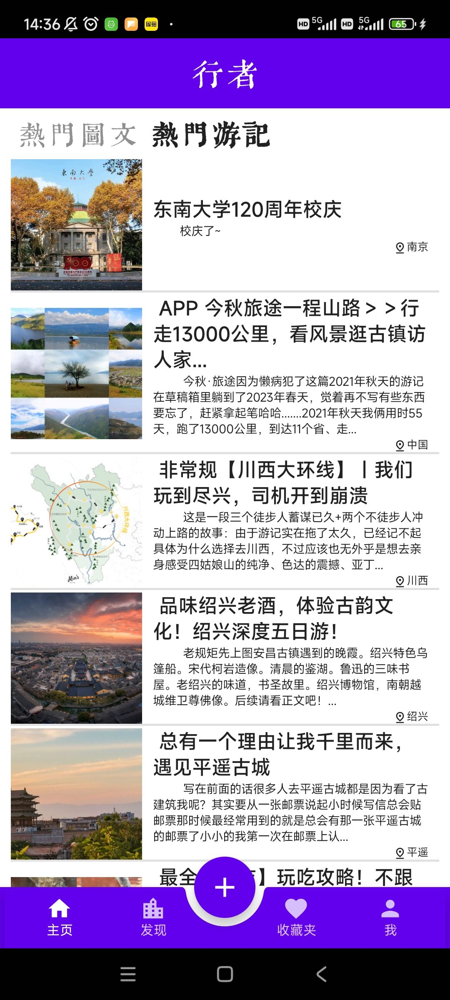
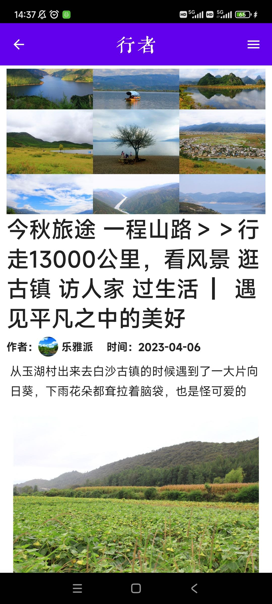
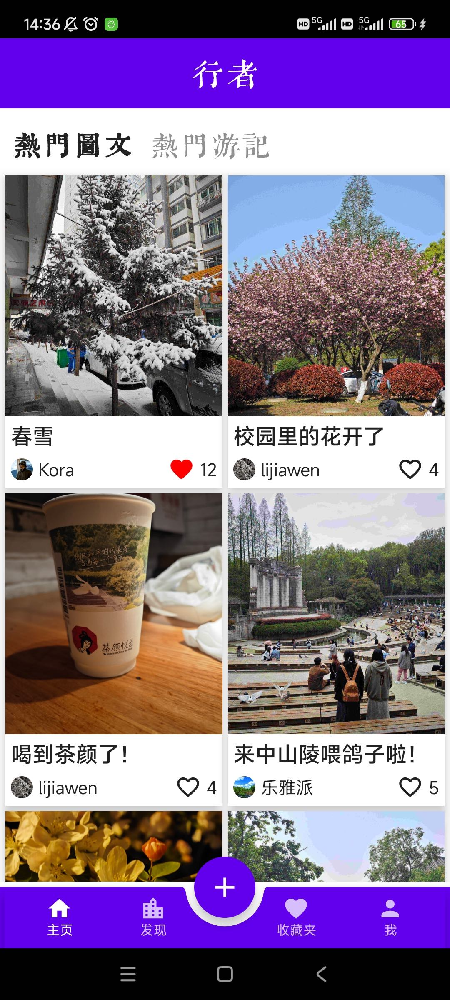
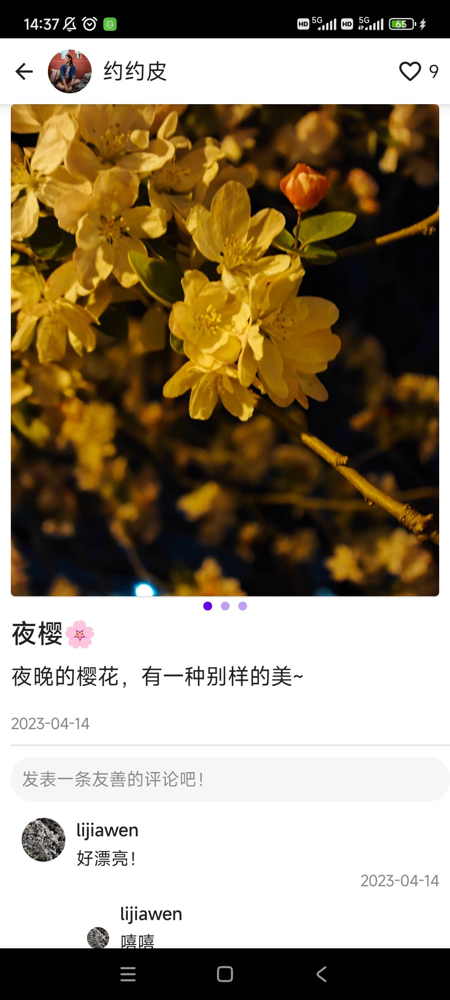
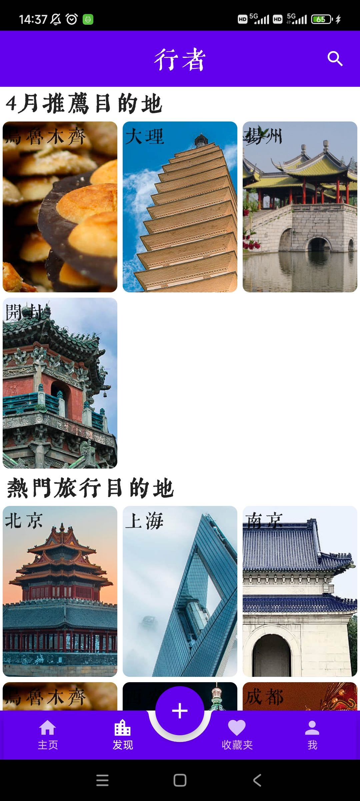
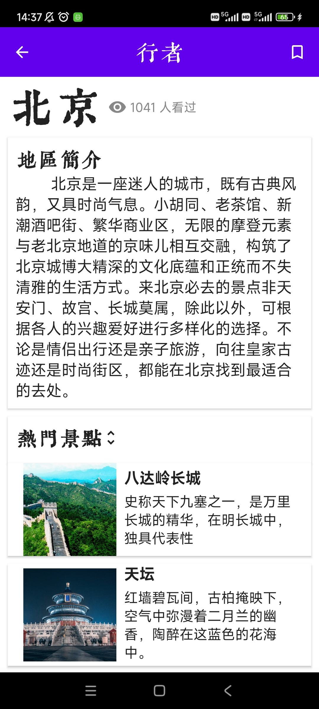
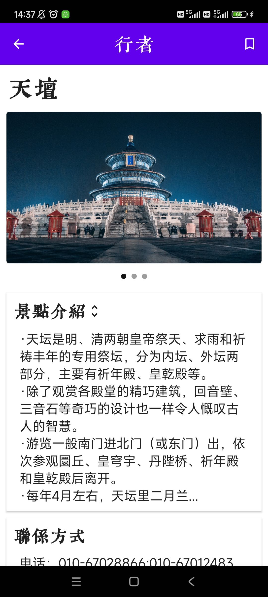
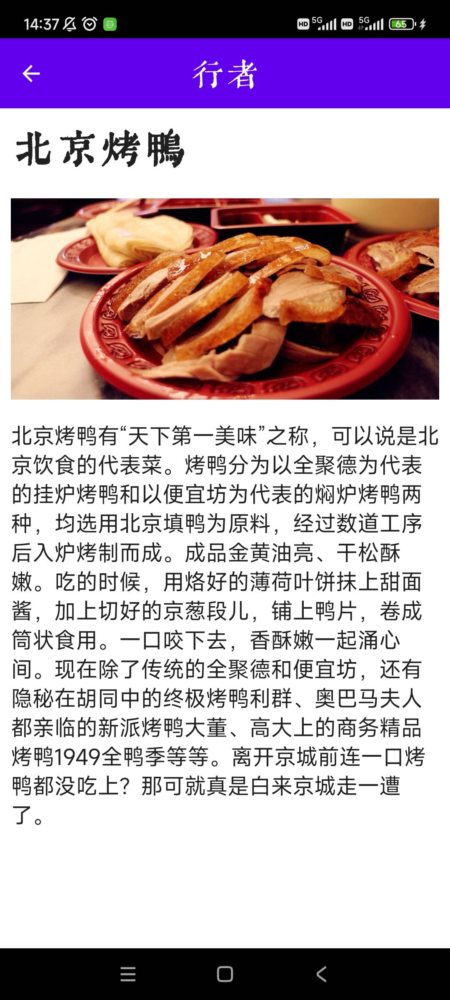

# TravelApp
A tiny travel app on Android with Jetpack Compose & Drogon Framework. Frontend and Backend separation.
## Intro
Technology stack：
+ Android with Jetpack compose
+ Drogon Framework
+ PostgreSQL

## Screenshots

    
    
    
    

  
  
  
  

## Functions
+ Support browsing travel notes and writing travel notes
+ Support to view region details
+ Support viewing attraction details
+ Support the collection of scenic spots and attractions
+ Access the AmAP api, you can jump to AmAP

## Server & Crawler
About how to deployment a server, please see "server/README.md" & "crawler/README.md"

## Hint
For better experience, please use a higher version of Android.

